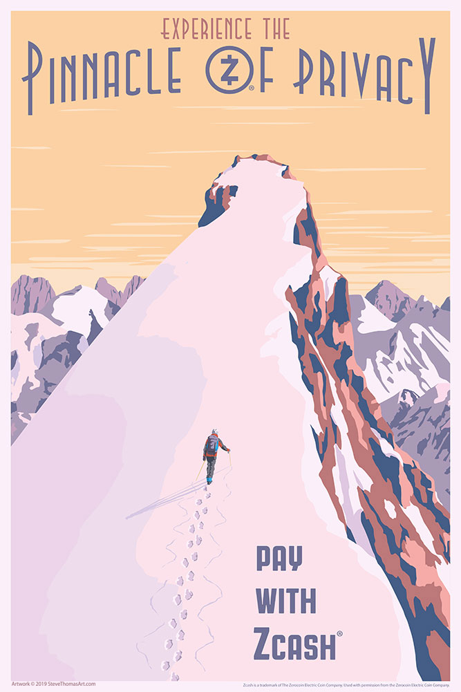

# The Zcash Poster Project

## Introduction

The Zcash posters on this site are inspired by vintage travel posters and vintage propaganda posters. They are the result of an ongoing collaboration between artist [Steve Thomas](https://www.stevethomasart.com) and Howard Loo (a member of the Zcash community and founder of the [Ycash Foundation](https://www.ycash.xyz)) and .

## Get the Posters!

These posters are licensed under the [Creative Commons By-NC-ND 4.0 license](https://creativecommons.org/licenses/by-nc-nd/4.0/). All the posters can be downloaded and printed for free. We encourage you to share these posters with friends and family! You are free to copy and redistribute these posters in any medium or format, but you may not use the posters for commercial purposes.

Steve Thomas provides affordable, licensed prints of most of these posters at [www.stevethomasart.com/propaganda-style](https://www.stevethomasart.com/propaganda-style).

Download all the posters in one zip file:

[zcash_posters_2019-06-05.zip](pdf/zcash_posters_2019-06-05.zip)

## About the Artist: Steve Thomas

Steve Thomas has created artwork under licenses from LucasFilm, Disney, Fox, Star Trek, Hasbro, and Marvel. Before becoming a freelance illustrator/graphic artist, Steve worked for newspapers creating graphics and illustrations for 14 years.

Steve draws inspiration from a number of sources, including vintage posters, early 20th century propaganda art, early 20th century product art, and mid 20th century retro-futuristic art.

No matter what the subject matter, from [Blink-82 concerts](https://www.stevethomasart.com/concert-posters) to [Star Wars](https://www.stevethomasart.com/large-grid-c23zf) to the [Minnesota Vikings Hall of Fame](https://www.stevethomasart.com/mnvikings), Steve's poster art is imbued with creativity, beauty, and (often) humor.

Prints of many of Steve's posters are available at [www.stevethomasart.com](https://www.stevethomasart.com).

You can also see Steve's latest work on [Twitter](https://twitter.com/stevethomasart), [Instagram](https://instagram.com/stevethomasart), and [Facebook](https://www.facebook.com/SteveThomasArt).

## Acknowledgements

This project was funded by a grant from the [Zcash Foundation](https://www.zfnd.org).

The use of the Zcash trademarks within these posters is licensed by the [Electric Coin Company](https://electriccoin.co).

Thank you to both the Zcash Foundation and the Electric Coin Company for their support of this project.

Special thanks to [Paige Peterson](https://twitter.com/ioptio) of the Electric Coin Company for guidance and help regarding the Zcash trademarks.

Special thanks to [Sonya Mann](https://twitter.com/sonyaellenmann) of the Zcash Foundation for providing feedback and encouragement.
